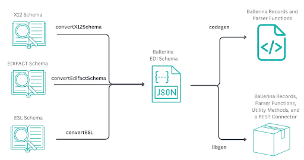

# EDI Tool Usage

This guide provides instructions on how to use the Ballerina EDI tool to generate Ballerina code from EDI schemas.



We have two x12 schemas.
1. 810.xsd - Schema for an invoice
2. 850.xsd - Schema for a purchase order

First, we need to convert the x12 schemas into Ballerina EDI schemas. For this we can use the `convertX12Schema` command of the EDI tool.

``` bash
% bal edi convertX12Schema -i x12-schemas/810.xsd -o ballerina-schemas/810.json
Converting schema x12-schemas/810.xsd...
```

``` bash
% bal edi convertX12Schema -i x12-schemas/850.xsd -o ballerina-schemas/850.json
Converting schema x12-schemas/850.xsd...
```

Now that we have the Ballerina EDI schemas, we can generate a Ballerina library for manipulating any EDI messages. This is done using the `libgen` command.

``` bash
% bal edi libgen -p aerospace/inventory -i ballerina-schemas/ -o .
Generating library package for aerospace/inventory : ballerina-schemas
```
Now, we can pack and push this library to Ballerina Central.

``` bash
% cd inventory

% bal pack
Compiling source
        aerospace/inventory:0.1.0
Creating bala
        target/bala/aerospace-inventory-any-0.1.0.bala

% bal push
aerospace/inventory:0.1.0 pushed to central successfully
```

Now, we can use this library in our Ballerina code.

``` ballerina
import ballerina/io;

import aerospace/inventory.m810;
import aerospace/inventory.m850;

public function main() returns error? {
    // read the purchase order from ./resources/po_11_06_2024.edi file
    string orderText = check io:fileReadString("./resources/po_11_06_2024.edi");
    m850:EDI_850_X12_005020_850 purchaseOrder = check m850:fromEdiString(orderText);
}
```